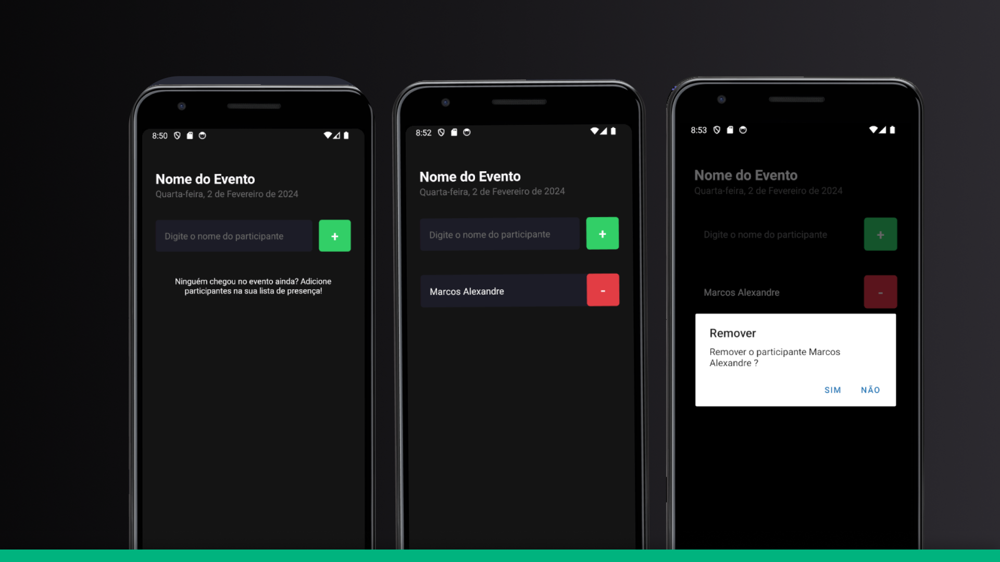

# Projeto: Ignite Lista de Presença

Neste desafio, você vai desenvolver uma aplicação de controle de **presença em eventos.**

##  Funcionalidades 💡
- Registrar a presença de um participante
- Remover um participante da lista de presença

Apesar de serem poucas funcionalidades, você vai precisar relembrar conceitos como:

- Estados
- Imutabilidade do estado
- Listas e chaves no React Native
- Propriedades
- Componentização


# Você Precisa 📃

* **Node.js** -- v16.10.0
* Aplicativo ExpoGo instalado no seu smartphone

# Executando ⚙

* Clone este repositório
* Dentro da pasta raiz do projeto, execute:

```bash
npm i
npm run start
```

* or (with yarn):

```bash
yarn
yarn start
```

* or even (with npx):

```bash
npm i
npx expo start
```
* Agora o expo está em execução!
* Abra o Expo Go no seu smartphone
* Toque em "Escanear QRCode"
* Escaneie o QRCode no seu terminal
* Pronto!

# Tecnologias 💻

* Expo
* React-Native
* TypeScript

## 📌 Versão

Nós seguimos o [SemVer](http://semver.org/) para controle de versão. Para ver as versões disponíveis, confira as [tags neste repositório](https://github.com/suas/tags/do/projeto). 


## 📄 Licença

Este projeto está licenciado sob a licença MIT.


---
⌨️ com ❤️ por [Marcos Anjos](https://singlebio.link/marcosanjos) 😊